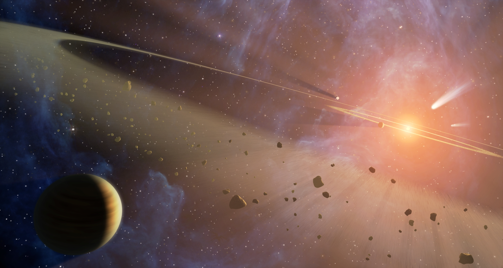

## Cosmic Context - Time

- What: 13 billion year old universe
- Why: Universe is expanding
- How do we know that, and who?:
- (*10 minutes*) Explain standard candles and show the data
	- stars in the sky have different brightnesses but some produce the
    same amount of light regardless of their distance, oscillating
    stars and collapsing white dwarves
	- drawing to show a candle of fixed brightness 2x further away is
      1/4 as bright (mention smartphone flashes are the modern candle)
  - Print of Hubble's Andromedae plate that established Milky Way is
  one of many Galaxies.
  -  Distance isn't enough to determine the age, how do we know they
	moving away from us?
		- We see that galaxies are moving away from by looking at the
        color of light - draw a spectrum?
		- Show how the precision of measurement has increased over time,
      converging on the age of the universe
- concluding **Activity** 3 minutes? Heart beat exercise, have everyone feel the number beats that
	correspond to the same fraction of their time on earth as a their
	time on earth is a fraction of the age of the universe
	
## Cosmic Context - What we don't know about our place

- Why don't we know if we are alone? Where are the pictures of other
planets? **Print of Earth from apollo photo**
- Distance to nearby town _(find town for alpha centuari)_
- Size of sun
- **Activity** (5 min) walk from the sun to the earth, given size of earth relative to sun (1/100)
- solar system context - stars with known planets - still working on
the census. *lookup latest discovered planet number on 20
Oct*. (xkcd.com Exoplanets illustration:)

-  5 minutes planets we know about.
	- what our imagination sees - print of Trappist-1 poster 
	- what do we know **draw how a transit observation works**: (https://exoplanets.nasa.gov/system/downloadable_items/315_TRAPPIST-1e_PRINT_E.jpg):
	- print of Venus
- **Activity** 4 minutes. Ask your neighbor, If we discover life on
  another world, would your life change? How?
- 5 minutes Asteroid belts we know about -  Epsilon Eridani (Backman et al 2009):
  - What we know (https://doi.org/10.1088/0004-637X/690/2/1522) (explain what plot means, draw copy on board, what's
    an errorbar?):
    (add colored pencil rainbow)
  -  print of what our imagination sees  https://photojournal.jpl.nasa.gov/catalog/PIA11375:
  
These are two of the nearest star systems we know about,
but we know very little about them. And our census of nearby stars is
incomplete, so we don't know if there are other nearer stars that have
Earthlike planets. 

Concluding activity: *2 min* Imaging firefly in the midwest. imagine a pair of binoculars
large enough to see it from portland (about as big as a 30 ft
sailboat). Now imagine a spotlight a yard from the firefly, pointed
back at you. Replace the firefly with a minauture planet and try to
discern if it has life...

Other possible images:

- photo of Henrietta Leavitt at work on standard candles from AIP 
    
